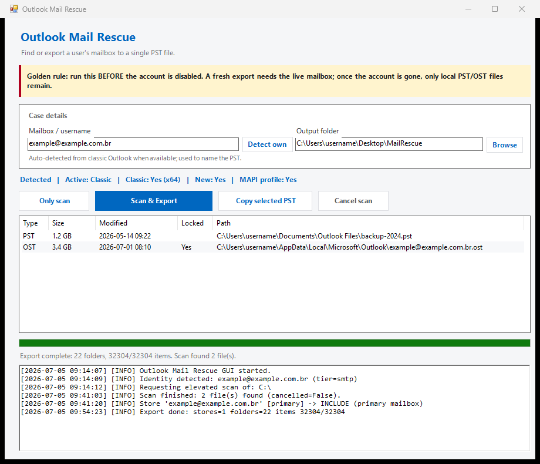

# 📨 Outlook Mail Rescue

[](https://github.com/bytedump/outlook-mail-rescue/actions/workflows/ci.yml)


A Windows GUI tool for help-desk technicians to preserve a leaving user's mailbox. It
finds an existing `.pst` anywhere on `C:\`, and when none exists it drives a **full** export
of the mailbox to a single Unicode PST through classic Outlook — every folder, sent *and*
received, not just the Inbox — and **validates the copy by per-folder item count** so silent
skips are caught. It detects the new Outlook and switches to classic so the export can run,
and it reports orphaned `.ost` files that need conversion.

> **🟡 Golden rule — run this BEFORE the account is disabled.** A full export relies on classic
> Outlook re-syncing the mailbox from the server. Once the account is deactivated or deleted,
> nothing can be re-downloaded and only local `.pst` / `.ost` files remain.

## 📸 Preview



> _Flat light WinForms GUI. Mailbox and output-folder values shown are placeholders._

## 📑 Table of Contents

- [Overview](#-overview)
- [What it captures (and what it does NOT)](#-what-it-captures-and-what-it-does-not)
- [Requirements](#-requirements)
- [Install & usage](#-install--usage)
- [How it works (architecture)](#-how-it-works-architecture)
- [Configuration](#-configuration)
- [Caveats & limitations](#-caveats--limitations)
- [Repository files](#-repository-files)
- [Development](#-development)
- [Roadmap](#-roadmap)
- [License](#-license)

## 📋 Overview

The manual ritual this replaces: hunt the disk folder by folder for a PST; if there is none,
open the user's Outlook (new *or* classic) and manually export everything; sometimes wrestle
with an orphaned OST. This tool automates the safe parts and is **explicit** about the parts
that are not solvable on the client.

- **Whole-disk scan** for `*.pst` and `*.ost` from the `C:\` root (not just the user profile),
  tolerant of access-denied folders, with live progress and a cancel button.
- **Full mailbox export to a single Unicode PST** via the classic Outlook COM object model —
  the primary mailbox plus the Online Archive, every folder, **with per-folder item-count
  validation** (the export is only "complete" when copied counts equal source counts).
- **New Outlook handling** — detects it and (with registry backup + later revert) switches the
  user to classic so the export can run. Honest dead-end if classic is not installed.
- **OST handling** — an OST tied to a live profile is captured by the full export. An orphaned
  OST is reported (path / size / date); FOSS conversion is on the roadmap (v2).
- **Two-process design** so an elevated disk scan and a non-elevated Outlook COM session can
  coexist (Windows blocks an elevated process from driving a normal-integrity Outlook).

## 🔒 What it captures (and what it does NOT)

This is a **client-side** export: it copies the live mailbox the way the user sees it. Be
honest with yourself about the boundary, especially for legal-hold cases.

| Captured ✅ | NOT captured ❌ |
|---|---|
| Every visible folder of the primary mailbox (Inbox, Sent, Deleted Items, Junk, Drafts, Calendar, Contacts, Tasks, Notes, Archive folder, custom folders…) | **Recoverable Items / the "dumpster"** — soft/hard-deleted (Purges), copy-on-write Versions, and hold data. These live in the mailbox's **non-IPM subtree, invisible to every Outlook client**, so no client-side export (ours *or* the File ▸ Export wizard) can reach them. |
| All item types in those folders (mail, appointments, contacts, tasks, notes) | **Items under legal hold / single-item-recovery** that were purged — recoverable only by an admin server-side. |
| The Online Archive store (on by default) | **Shared / delegate mailboxes** and **Public Folders** (opt-in; off by default) and **M365 Groups / Teams** (separate mailboxes, not in the profile). |
| Folder hierarchy + per-folder item counts (validated) | **Folder views, rules, permissions, categories** — the `CopyTo` engine does not carry these (mail + hierarchy are preserved). |

> **For a complete legal-hold capture** (including purged/held items), use a **server-side**
> export instead: `New-MailboxExportRequest` on Exchange on-premises, or **Microsoft Purview
> eDiscovery / Content Search** PST export on Microsoft 365 (requires admin + the eDiscovery
> role). This tool is for *preserving the user's working mail before offboarding*, fast and
> without admin rights — not for forensic completeness.

> **ℹ️ Note on "Deleted Items".** A new PST ships its own empty special folders, so the copied
> *Deleted Items* lands in the PST as **`Deleted Items - Copy`** (the built-in one stays empty).
> The data is all there — just under that name.

## ✅ Requirements

- Windows 10/11, **Windows PowerShell 5.1** (the launcher uses `powershell.exe`, not `pwsh`).
- **Classic Outlook installed _and activated/licensed_** for the export path (the tool detects
  it; a grace/unlicensed Outlook may pop an activation dialog that blocks COM).
- Local **administrator** rights for the disk scan (one UAC prompt at scan time).
- The mailbox account still **active and signable** for a fresh export.
- The Outlook policies `DisableCrossAccountCopy`, `DisablePST`, `PSTDisableGrow` **not** set —
  any of them can block or silently neutralise a client-side PST export (the tool warns on the
  first; the others would surface as a failure).

## 🚀 Install & usage

```powershell
git clone https://github.com/bytedump/outlook-mail-rescue.git
cd outlook-mail-rescue
copy config.example.ps1 config.ps1   # optional: adjust defaults
```

No build step — the PowerShell modules are dot-sourced at runtime.

Double-click **`run.bat`** (or run it from a terminal). It launches the GUI non-elevated.

1. Review the **Detected** line (Active flavor, classic yes/no + bitness, MAPI profile). The owner is
   auto-detected from classic Outlook on startup and pre-fills the **Mailbox / username**; press
   **Detect owner** to retry, or type it in manually.
2. Confirm the **Mailbox / username** (names the output PST) and the **Output folder**.
3. **Scan & Export** (blue) does both in one run: it scans `C:\` for existing `.pst` / `.ost` files
   *and* runs a fresh full export, whether or not a PST already exists. Confirm once (owner
   + mailbox + computer + target PST), approve the single UAC prompt for the scan, and sign in if
   Outlook prompts. From there it is hands-off: it auto-switches new→classic when needed (a revert is
   offered at the end), copies the whole profile into a new Unicode PST, and validates the counts.
   Use **Only scan** (white) instead to just locate existing `.pst` / `.ost` files on the disk without
   touching Outlook — one UAC prompt, no export, no confirmation dialog.
4. The export PST is named **`owner@company.com.DD-MM-YYYY.pst`** — a same-day re-run gets an extra
   time suffix, so an earlier backup is never overwritten. Scanned files are listed below:
   **Copy selected PST** copies an already-existing PST to the output folder — and, like the export,
   it **never overwrites**: if a file of that name is already there the copy lands as `name (2).pst`,
   `name (3).pst`, … so an earlier rescued backup is safe. An orphaned OST is reported only
   (conversion is on the v2 roadmap).
5. Collect the PST and the run log (under `%LOCALAPPDATA%\OutlookMailRescue\logs`).

## 🧠 How it works (architecture)

The tool runs as **two processes**, by necessity:

- The **GUI + Outlook COM** run **non-elevated**. An elevated (high-integrity) process *cannot*
  drive a normal-integrity Outlook — Windows UIPI blocks it, so the export would fail. The
  entry script also **relaunches itself** in the `powershell.exe` whose **bitness matches
  Outlook** (32/64-bit), because COM Interop requires it.
- The **disk scan** runs in a separate **elevated** helper (`-ScanHelper`, spawned with
  `Start-Process -Verb RunAs`) so it can read all of `C:\`. Progress and results come back to
  the GUI as JSON files it polls on a timer (the UI never freezes).

The export itself has no COM equivalent of the File ▸ Import/Export wizard, so it is a **folder
copy**: create a new Unicode PST with `Namespace.AddStoreEx(path, olStoreUnicode)`, then
`MAPIFolder.CopyTo` each top-level folder of every included store (one call copies the whole
subtree + items — it is *not* recursed afterward), validate item counts per top-level folder,
then detach the PST with `RemoveStore` (the `.pst` file stays on disk).

The launcher uses `-ExecutionPolicy Bypass` **per process** — it never changes the machine's
execution policy.

## ⚙️ Configuration

Copy `config.example.ps1` to `config.ps1` (gitignored) and edit. Absent → built-in defaults.

| Key | Default | Meaning |
|---|---|---|
| `OutputFolder` | `%USERPROFILE%\Desktop\MailRescue` | Where the PST + log land. ⚠️ Do not point this at a OneDrive/SharePoint-synced folder — the whole mailbox would upload to a personal cloud. The GUI can override it per run. |
| `FileNameTemplate` | `{username}_{stamp}.pst` | Tokens: `{username}`, `{stamp}` (`yyyyMMdd-HHmmss`), `{ticket}`. |
| `ScanRoots` | `@('C:\')` | Disk-scan roots. |
| `IncludeArchive` | `$true` | Fold the user's Online Archive store into the export. |
| `IncludeSharedMailboxes` | `$false` | Delegate/shared mailboxes (often huge). |
| `IncludePublicFolders` | `$false` | Rarely wanted; needs Exchange permissions. |
| `SyncTimeoutMinutes` | `30` | Max wait for a fresh Cached Exchange Mode sync before exporting. |
| `OstConverterPath` | `''` | v2 only: external OST→PST converter. Empty = orphaned OST stays report-only. |

## ⚠️ Caveats & limitations

- **Authentication / MFA may need a human.** If the account is already signed in (Office
  identity / SSO), the export is hands-off; if a password or MFA prompt appears, the tool
  pauses for someone to authenticate. A script cannot — and must not — bypass MFA.
- **New Outlook cannot export to PST** and has no COM — switching to classic is required.
- **`CopyTo` does not carry** folder views, permissions, rules, or categories; mail items and
  folder hierarchy are preserved. Item counts are validated and discrepancies logged.
- **Mail arriving mid-export is normal.** The copy is validated by item count, and the mailbox is
  not frozen during the run — if new mail lands while copying, the copy can end up **larger** than
  the inbox. That is expected (new mail, nothing lost) and is reported as an informational note, not
  an error. A **smaller** copy is the one worth attention. For a pristine snapshot, optionally set
  Outlook to **Work Offline** (Send/Receive tab) or disconnect before exporting — optional, never
  required; it only stops Outlook syncing, not the whole PC.
- **A PST is unencrypted** and holds the entire mailbox. Store output on an access-controlled
  location; do not leave it on a shared drive or a synced cloud folder.
- **The output PST name embeds the user's identity** — treat it as personal data per your
  retention policy.

## 🗂️ Repository files

| Path | Description |
|---|---|
| `Invoke-MailRescue.ps1` | Single entry point. Modes: default (GUI), `-ScanHelper`, `-LoadOnly`; bitness self-relaunch. |
| `run.bat` | Double-click launcher (non-elevated, `-STA`, `ExecutionPolicy Bypass`). |
| `src/Gui.ps1` | WinForms GUI (flat light theme), the scan-poll + export-runspace timer. |
| `src/OutlookDetect.ps1` | Detect new vs classic, paths, bitness, `UseNewOutlook`, MAPI profile. |
| `src/Scan.ps1` | Whole-disk `.pst`/`.ost` scan (runs in the elevated helper). |
| `src/ComExport.ps1` | Full mailbox → PST export via COM, with per-folder count validation. |
| `src/NewOutlookToggle.ps1` | Switch new→classic with registry backup + revert. |
| `src/ProfileSync.ps1` | Wait for Cached Exchange Mode sync to settle. |
| `src/Logging.ps1` | Structured logging (file + host + GUI queue). |
| `config.example.ps1` | Configuration template — copy to `config.ps1`. |
| `tests/unit/` | Pester 5 unit tests for the pure functions. |
| `PSScriptAnalyzerSettings.psd1` | Lint policy (should report 0 findings). |

**Not versioned** (gitignored): `config.ps1`, `logs/`, `*.log`, `*.pst`, `*.ost`.

## 🧪 Development

```powershell
# Unit tests (Pester 5)
Invoke-Pester -Path .\tests\unit

# Static analysis (repo policy; should report 0 findings)
Invoke-ScriptAnalyzer -Path .\src -Recurse -Settings .\PSScriptAnalyzerSettings.psd1

# Dot-source the modules without launching anything (used by the tests)
powershell -NoProfile -ExecutionPolicy Bypass -File .\Invoke-MailRescue.ps1 -LoadOnly
```

The COM export path requires classic Outlook and is validated manually (it cannot run on a
machine that only has the new Outlook). Pure helpers are unit-tested.

## 🚧 Roadmap

- **Auto-detect the mailbox owner** — prefill the username from Outlook (`CurrentUser`) so the
  technician does not type it, with a mandatory identity confirmation before export.
- **Orphaned-OST → PST conversion** using a FOSS reader (`libpff`/`pypff`), email-first, packaged
  as a standalone executable. Best-effort and transparent about fidelity; falls back to
  report-only if conversion fails.
- **Sidecar manifest** (detected owner, store list, counts, technician, UTC stamp) next to each
  PST for chain-of-custody.

## 📄 License

Released under the [MIT License](LICENSE).
